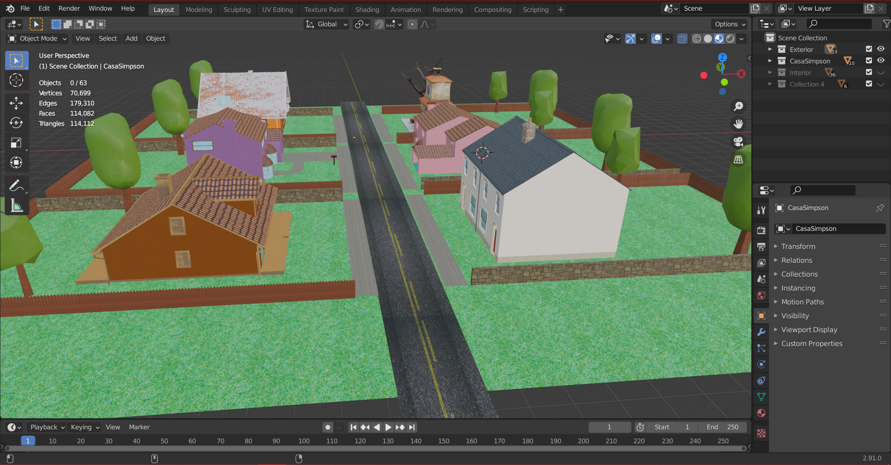
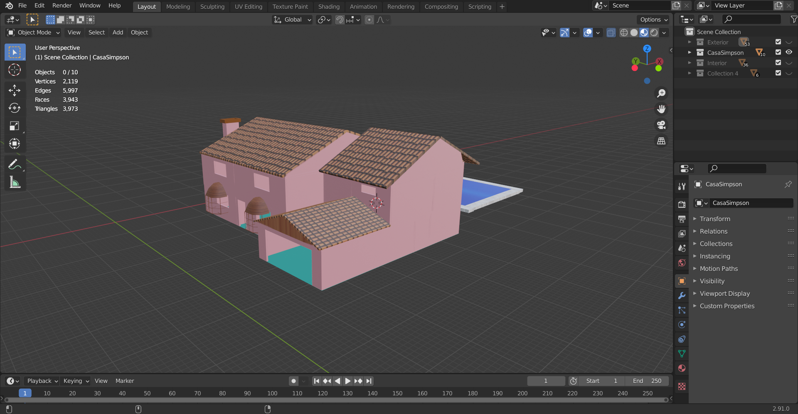
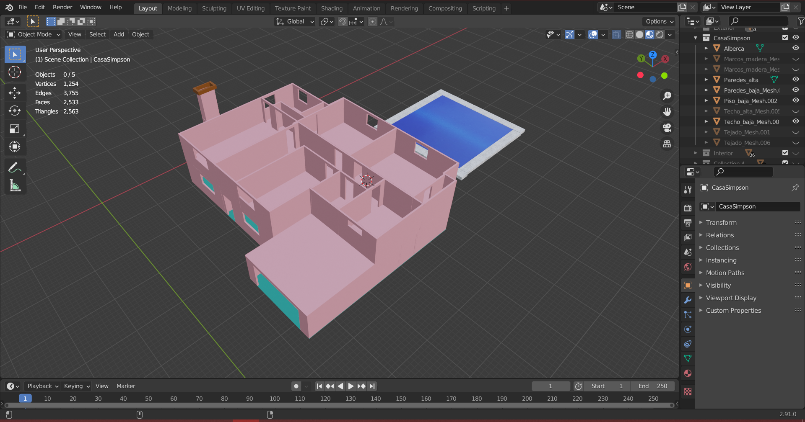
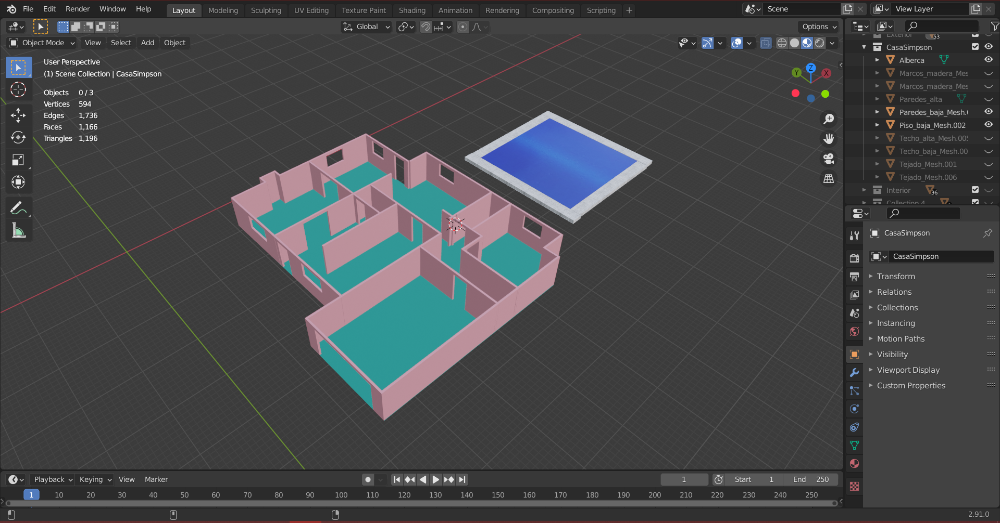
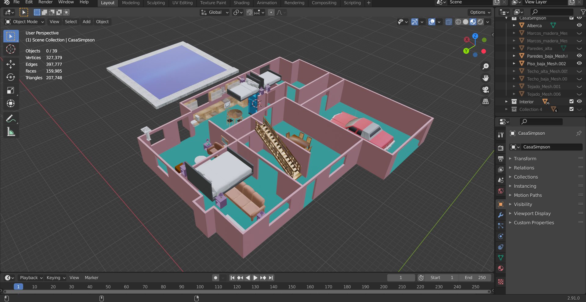
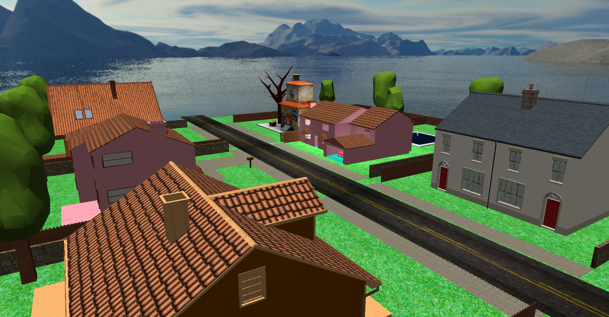
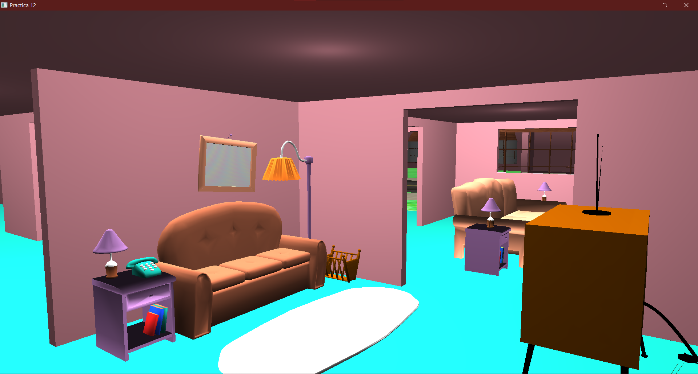

# Proyecto Computación Gráfica 2021-1!
> **Integrantes del proyecto:**
> - Cabello Aguilar Héctor Eduardo
> - García Andrea
> - Rueda Luz

Este repositorio contiene el **desarrollo del proyecto final** de la materia Computación Gráfica e interacción humano computadora.

El proyecto consiste en crear un ambiente virtual en el que se recrea un área residencial, con los siguientes elementos:
- Espacio interior: 3 recamaras, 2 baños, sala, comedor, cocina, cochera, jardín con alberca y los muebles de los mismos espacios
- Construcción de la fachada y de la parte exterior de la casa: cochera, jardín con arboles y una alberca
- 5 animaciones complejas, al menos una por la técnica de KeyFrames.
- Incorporar una biblioteca de audio para agregara música de fondo

Este proyecto cuenta con un [manual de usuario](link/al/archivo/pdf) en el que se describe claramente como está distribuida la estructura de carpetas, como configurar el proyecto en visual studio y como ejecutar el archivo .*exe*. El manual también incluye una descripción del escenario y las teclas que deben utilizarse para navegar entre este.

# Capturas de pantalla
### Modelos

### Implementación

